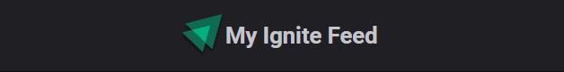
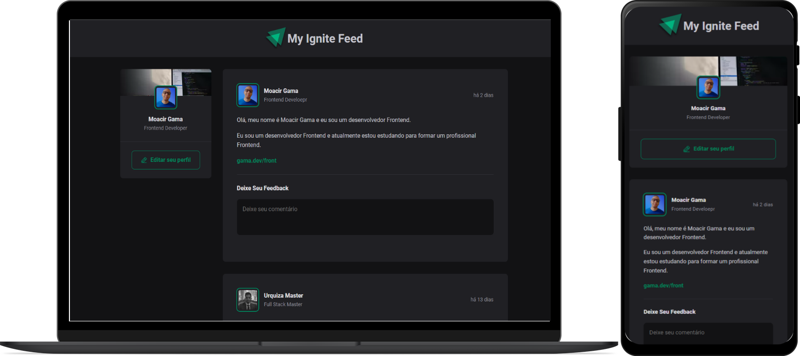

<h1 align=center> My Ignite Feed 🟩 </h1> 
<p align=center>
  
</p>

  <h1 align="center">  
    <a href="https://www.typescriptlang.org/" target="_blank"  rel="noopener noreferrer" >
      
    </a>
    <a href="https://pt-br.reactjs.org/docs/getting-started.html" target="_blank"  rel="noopener noreferrer">
      
    </a>
    <a href="https://code.visualstudio.com/" target="_blank"  rel="noopener noreferrer">
      
    </a>
   </h1>

<h6 align=center>
  <a href="#notebook-about">About</a>&nbsp;&nbsp;&nbsp;|&nbsp;&nbsp;&nbsp;
  <a href="#hammer-technologies">Technologies</a>&nbsp;&nbsp;&nbsp;|&nbsp;&nbsp;&nbsp;
  <a href="#black_nib-getting-started">Getting Started</a>&nbsp;&nbsp;&nbsp;|&nbsp;&nbsp;&nbsp;
  <a href="#hammer-technologies">Technologies</a>&nbsp;&nbsp;&nbsp;|&nbsp;&nbsp;&nbsp;
</h6>

# :notebook: About

The **My Ignite Feed** is an website to improve ReactJS and TypeScript knowledge.

You can look on: link here

Presently this app only works create and delete comments, rest is Mocked.


<div align="center">
    

</div>

# :hammer: Technologies

#### 📃 Dependencies: -> <i><kbd> [package.json](./package.json) </kbd></i>

- [x] <b>[React Js](https://reactjs.org/):</b> <i>JS Lib to build interface</i>
- [x] <b>[Typescript](https://www.typescriptlang.org/):</b> <i>It's written in TypeScript</i>
- [x] <b>[Date FNS](https://date-fns.org/):</b> <i>Beste date utility library </i>
- [x] <b>[Vite Js](https://vitejs.dev/):</b> <i>Project creation tool </i>
- [x] <b>[Phosphor Icons](https://github.com/phosphor-icons/phosphor-react):</b> <i>Icon Pack </i>


# :black_nib: Getting Started

If you want to run this app on your dev workspace, look that:

You must have installed:

1. **Node.js**. <i>[Here](https://nodejs.org/en/)</i>
2. **GIT**. <i>[Here](https://git-scm.com)</i>


Downloading dependencies:

```bash
  $ npm install

  # or

  $ yarn
```

:fire: Once dependencies download, just run your start command :

```bash
  $ npm dev

  # or

  $ yarn dev
```

<p align=center> 
  <h6 align=center>💙 Made by</h6> 
  <h2 align=center>
  <a href="https://www.linkedin.com/in/gama-leal">  Moacir Gama
    
  </a>
  </h2>
</p>
